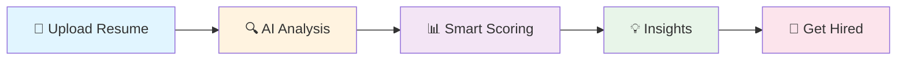

<div align="center">

```
 ____                 _____ _            _  _____ ____  
|  _ \ __ _ ___ ___  |_   _| |__   ___  / \|_   _/ ___| 
| |_) / _` / __/ __|   | | | '_ \ / _ \/ _ \ | | \___ \ 
|  __/ (_| \__ \__ \   | | | | | |  __/ ___ \| |  ___) |
|_|   \__,_|___/___/   |_| |_| |_|\___/_/   \_\_| |____/ 
```

### *Where AI meets your career aspirations*

[](https://www.python.org/)
[](https://ai.google.dev/)
[](LICENSE)

[Quick Start](#-quick-start) · [Features](#-what-you-get) · [Demo](#-try-it-now)


</div>

## 💭 The Story

You've spent hours perfecting your resume. You hit submit. **Silence.**

Was it the keywords? The format? The ATS? You'll never know—until now.

**PassTheATS** doesn't just scan your resume. It thinks like a recruiter, validates like an ATS, and coaches like a mentor. All powered by AI.

<br>

## ✨ What You Get

<table>
<tr>
<td>

**🎯 Smart Analysis**
- ATS compatibility score
- Keyword optimization
- Skill proof verification
- Authenticity check

</td>
<td>

**🤖 AI Insights**
- Improvement suggestions
- Interview questions
- Recruiter verdict
- Gap analysis

</td>
<td>

**📊 Your Dashboard**
- Analysis history
- Progress tracking
- Report management
- Dark mode ✨

</td>
</tr>
</table>

<br>

## 🎨 Built With

```javascript
const PassTheATS = {
  brain: "Google Gemini AI",
  backend: "Python + Flask",
  frontend: "HTML/CSS/Bootstrap",
  database: "SQLite",
  magic: "Intelligence + Simplicity"
}
```

<br>

## 🚀 Quick Start

### 1️⃣ Clone the repository
Open your terminal and run the following commands to clone the repo and navigate into the directory:

```bash
git clone https://github.com/raahul-kr/PassTheATS.git
```
```
cd PassTheATS
```
### 2️⃣ Install dependencies
Install the required Python packages using pip:

```bash
pip install -r requirements.txt
```

### 3️⃣ Configure environment variables
Create a .env file in the project root directory:
```bash
GEMINI_API_KEY=your_gemini_api_key_here
```

### 3️⃣ Run the app
Start the Flask development server:

```bash
python app.py
```
### 4️⃣ Open in browser
Once the server is running, open your web browser and navigate to:

**🌐 Open:** `http://localhost:5000`

<br>

## 🎯 How It Works



<br>

## 💡 The Difference

| Others | PassTheATS |
|:------:|:----------:|
| ❌ Just keyword matching | ✅ Skill proof validation |
| ❌ Generic percentage | ✅ Role-based rubrics |
| ❌ No actionable advice | ✅ AI-powered suggestions |
| ❌ One-time scan | ✅ Progress tracking |
| ❌ Black box | ✅ Transparent insights |

<br>

## 🎪 Try It Now

**Demo Mode** → No signup needed  
**Full Power** → Create free account

```
┌─────────────────────────────────────┐
│  📂 Upload PDF                      │
│  📝 Paste Job Description           │
│  ⚡ Click Analyze                   │
│  🎉 Get Insights in Seconds         │
└─────────────────────────────────────┘
```

<br>

## 🗺️ Roadmap

**Now** ✅
- Core ATS engine
- AI integration
- User accounts

**Next** 🚧
- 🐳 Docker deployment
- 📄 PDF export
- ☁️ Cloud hosting

**Future** 🌟
- Multi-resume comparison
- LinkedIn integration
- Cover letter analysis
- Team features

<br>

## 📂 Project Map

```
PassTheATS/
├── 🧠 core/           # Intelligence layer
├── 🎨 templates/      # User interface
├── 💾 db/             # Data models
├── 📁 static/         # Assets & styles
└── 🚀 app.py          # Mission control
```

<details>
<summary>📋 View detailed structure</summary>

```
PassTheATS/
│   app.py
│   requirements.txt
│   README.md
│
├── core/
│   ├── resume_parser.py
│   ├── resume_sections.py
│   ├── keyword_extractor.py
│   ├── scoring_engine.py
│   ├── proof_checker.py
│   ├── cheat_detector.py
│   ├── interview_questions.py
│   ├── ai_interview_questions.py
│   ├── ai_suggestions.py
│   ├── ai_summary.py
│   ├── rubrics.py
│   ├── jd_templates.py
│   └── jd_parser.py
│
├── db/
│   └── models.py
│
├── templates/
│   ├── index.html
│   ├── demo.html
│   ├── report.html
│   ├── login.html
│   ├── register.html
│   └── history.html
│
├── static/
│   ├── style.css
│   └── js/
│       └── theme.js
│
├── instance/
│   └── hirelens.db
│
└── uploads/
    └── resumes/
```

</details>

<br>

## 🛠️ Configuration

Create `.env` file:

```bash
GEMINI_API_KEY=your_api_key
FLASK_ENV=development
SECRET_KEY=your_secret
```

<details>
<summary>⚙️ Advanced settings</summary>

```python
# Customize scoring weights in core/rubrics.py
RUBRICS = {
    "Software Engineer": {
        "skills_weight": 0.35,
        "experience_weight": 0.30,
        "projects_weight": 0.20,
        "education_weight": 0.15
    }
}
```

</details>

<br>

## 🤝 Contributing

Found a bug? Have an idea? We'd love your help!

```bash
# Fork → Clone → Branch → Code → PR
git checkout -b feature/your-amazing-idea
```

<br>

## 📜 License

MIT © 2025 Rahul Kumar  
*Free to use, free to modify, free to share*

<br>

<div align="center">

## 👨‍💻 Creator

**Rahul Kumar**  
*B.Tech CSE · Backend & Cloud Enthusiast*

[](https://github.com/raahul-kr)
[](https://linkedin.com/in/raahul-kr)

*Building tools that make a difference* 🚀

<br>

---

<sub>**PassTheATS** · Empowering job seekers with AI-driven insights</sub>

⭐ Star this repo if it helped you land an interview!


**Made with ❤️ and lots of ☕**

</div>
